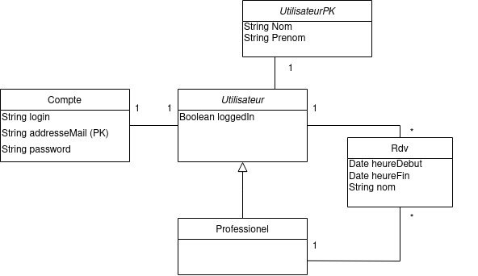

#TP3 Partie 3

Tous les connections en base de données se font via mysql et phpmyadmin. (via les lignes de commandes docker données sur la page de cours TAA).  
Php MyAdmin disponible en http://localhost:8082  
Login : root  
Mot de passe : my-secret-pw  
Table : Test (si elle n'existe pas il faut la créer)  

  
Une fois le projet compilé, il faut lancer le main SampleDataJpaApplication.
L'api est disponible sur le port 8080

Voici le diagramme d'objet de mon application doctolib :

