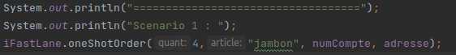
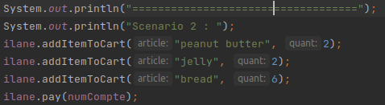
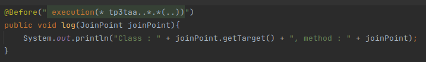
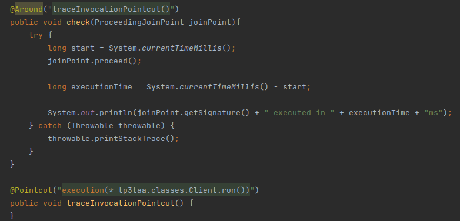

#TAA TP3 - Nathan CHAMBRON

##Partie 1

Pour la première partie, il était demandé de mettre en place une application de gestion de magasin à l'aide de Spring.
Mon application comporte 4 acteurs et 2 scénarios différents :

###acteur 1 - client
La classe Client implémente les interfaces IRun pour démarrer l'application et IClient pour le typer de façon simple. il est en relation avec toutes les interfaces serveur du l'acteur magasin.
###acteur 2 - store
La classe Store fournit les 3 services qui correspondent chacun à une interface serveur. il Implemente également IStore pour les mêmes raisons de typages que Client.
###acteur 3 - banque
La classe Bank permet de faire un transfert d'un compte à un autre.
###acteur 4 - fournisseur
Enfin la classe Provider permet de réapprovisionner le magasin avec les méthodes getPrice et order
###scénario 1
Le client effectue une commande de 4 jambons

###scénario 2
Le Client ajoute du beurre de cacahuètes, de la confiture et du pain à son panier puis paye.

##Partie 2
Pour la mise en place de l'AOP j'ai créé la classe Monitor.
Afin de tester le côté trace de l'aspect j'ai implémenté une méthode de type before avant toutes les méthodes de mon projet qui indique à l'utilidateur les classe appelante ainsi que la méthode appelée

Et pour le côté sécurité j'ai mis en place une méthode de type around qui permet le calcul du temps d'execution de la méthode run du Client.

##Partie 3
